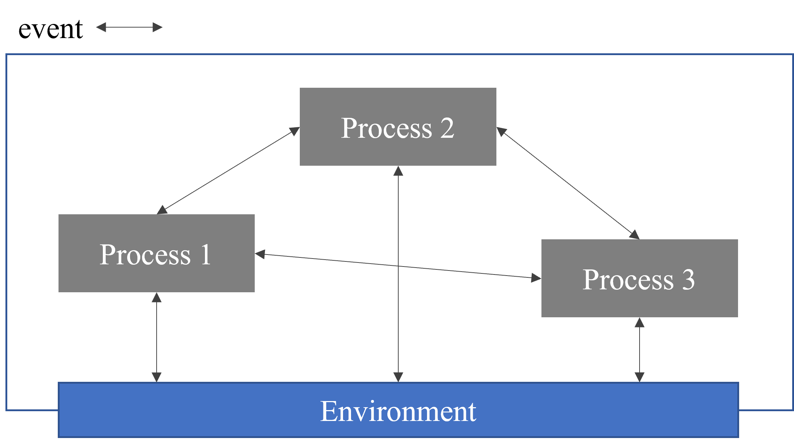

# 1. SimPy in 10 Minutes

## 1) 설치하기 (Installation)

### pip로 설치하기
```
pip install simpy
```

### 파일 다운로드 받아 직접 설치하기
- 파일 다운로드 위치: https://pypi.org/project/simpy/

```
python setup.py install
```

## 2) 기본 개념 (Basic Concepts)


- Discrete-event simulation library
- 움직이는 컴포넌트(메시지, 고객, 차량 등)를 프로세스와 함께 모델링
- 모든 프로세스는 environment 안에 있음. 프로세스는 event를 통해 environment 및 서로와 상호작용함
- 프로세스는 Python generator로 설명될 수 있음. 이는 이벤트를 생성하고, 작동(발생, occur) 대기하게 함
- 다수의 프로세스는 같은 이벤트를 위해 대기할 수 있으며, Simpy는 생성될 때와 동일한 순서로 다시 시작함
- `Time out`: 일정 시간이 경과한 후 발생. 이는 method(ex. evironment.timeout())을 호출하여 생성 가능

### 예제: Car process
- 스크립트 [[링크]](https://github.com/KIMHYEMEE/simpy-tutorial/blob/main/01_Basic_Concept.py)
- 차량이 일정 시간동안 주차 후 운행(drive)
- 주차 및 운행 시작 시 environment의 시간이 출력

## 3) Process Interaction

## 4) Shared Resources

## 5) How to Proceed
- 예시 시뮬레이션 스크립트 [[링크]](https://simpy.readthedocs.io/en/latest/examples/index.html)
- 구체적인 설명 [[링크]](https://simpy.readthedocs.io/en/latest/topical_guides/index.html)
- Documantation (API Reference) [[링크]](https://simpy.readthedocs.io/en/latest/api_reference/index.html)

# 2. Topical Guides
1. Simpy basic [[링크]](https://github.com/KIMHYEMEE/simpy-tutorial/blob/main/02_Simpy_basic.py)
2. Environments
3. Events
4. Process Interaction
5. Shared Resources
6. Real-time simulations
7. Monitoring
8. Time and Scheduling